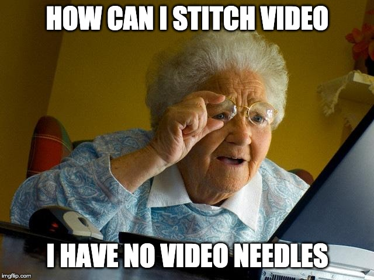
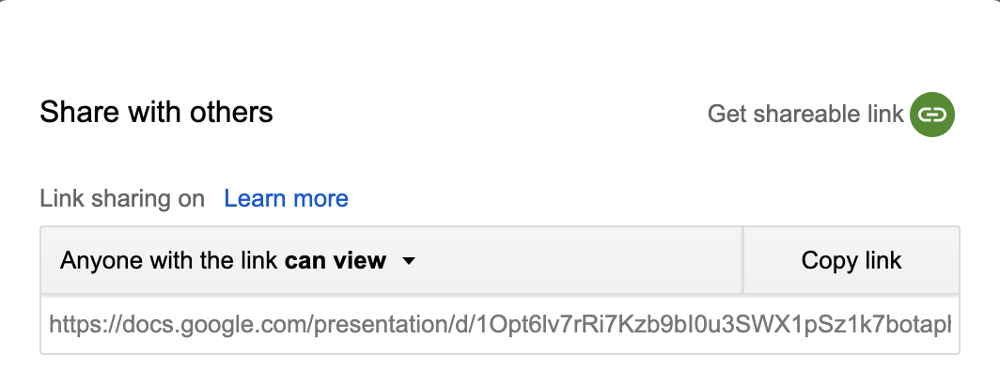

<style type="text/css">
article {
  font-size: 28pt;
}
</style>

```{r setup, include=FALSE}
knitr::opts_chunk$set(
  echo = FALSE, 
  comment = "",
  message = FALSE, 
  cache = TRUE)
library(ari)
library(ariExtra)
knitr::knit_engines$set(speak = text2speech::tts_speak_engine)
```


## Overall Goals of the Project

- Make reproducible videos 
- Provide users flexibility of what Services (Google/Amazon) they want to use
- Translate video into another language

- `ari` creates reproducible videos, but ...

<!-- SMI 2019 product -->
# Goal: Harmonize all inputs to `ari`

## Workflow of `ari` 

```{r, echo = FALSE, out.width="100%"}
knitr::include_graphics("figure/ari_workflow.png")
```


## Workflow of `ari` - functions

- Images with a audio → `ari_stitch`
- Rmd document with HTML comments → Images with a text script (`ari_narrate`)
- Images with a text script → `ari_spin`


## Workflow of `ari`: Version 1.0

<div id="left_col">

- Synthesize audio through Amazon Polly
- Do checks with length of images and audio/text
- Set a whole bunch of `ffmpeg` flags and run `ffmpeg` through `system`
- Audio + Images → `ffmpeg` → mp4

</div>

<div id="right_col">

Example of checks

```{r, out.width = "100%"}

```
</div>


## Workflow of `ari`: Version 2.0

- Text script → audio (through `text2speech` package)
- Synthesize audio through `text2speech` package
- Use `ariExtra` to unify the output format to use one `ari` function
- Create an `ffmpeg` package (short term, not done) and pass to that
- Pass images and such through `av` package (long term)

# `text2speech`: Harmonizing Text to Speech Packages

## Text to Speech

<div id="left_col">

- `googleLanguageR` - Google Cloud Services
- `aws.polly` - Amazon Polly
- `mscstts` - Microsoft Text-to-Speech or Bing Speech (my package)

</div>

<div id="right_col">
`text2speech` 
```{r, out.width = "100%"}
knitr::include_graphics("figure/rule_them_all.gif")
```
</div>


## Text to Speech: `knitr` Enginge

Add this to the header
````markdown 
`r ''````{r}
knitr::knit_engines$set(speak = text2speech::tts_speak_engine)
```
````

Then have a code chunk like:

````markdown
`r ''````{speak, service = "amazon", voice = "Joanna"}
Here are a bunch of words to say stuff
```
````

## Text to Speech Example

Amazon

```{speak amazon, service = "amazon"}
Hello, my man, how are you? My name is john!
```

Google

```{speak google, service = "google"}
Hello, my man, how are you? My name is john!
```

Microsoft

```{speak microsoft, service = "microsoft"}
Hello, my man, how are you? My name is john!
```


## Workflow of `ariExtra` 

- PPTX with notes →  `pptx_to_ari`
- Google Slides with notes →  `gs_to_ari`
- `ioslides` Rmd with comments →  `rmd_to_ari`
- `xaringan` Rmd with comments →  `rmd_to_ari`
- PDF + text → `pdf_to_ari`

- All `*_to_ari` functions → `make_ari_document` → PNGs + comments in MD

## Google Slides Example

https://docs.google.com/presentation/d/1Opt6lv7rRi7Kzb9bI0u3SWX1pSz1k7botaphTuFYgNs/edit#slide=id.p

```{r, out.width = "80%"}
knitr::include_graphics("figure/gs_snap.png")
```

## Google Slides Example

```{r getting_id, echo = TRUE}
id = get_slide_id(
  paste(
    "https://docs.google.com/presentation/d",
    "1Opt6lv7rRi7Kzb9bI0u3SWX1pSz1k7botaphTuFYgNs", 
    "edit#slide=id.p", sep = "/"))
id
```

## Google Slides Example

```{r gs_to_ari, echo = TRUE, eval = TRUE, message = TRUE}
result = gs_to_ari(id, verbose = FALSE); xx = readLines(result$output_file)[1:15]
names(result); 
head(result$script, 2)
head(result$images, 2)
```

## Google Slides Example

```{r gs_to_ari_out, echo=TRUE, eval=TRUE}
cat(xx, sep = "\n")
```

## Output (currently)

- Markdown file with comments in HTML (md so `knitr` not run)
- Can hit `Knit` in RStudio 
- Images converted to PNGs 


# Live Demo

## What you need for `ari`

- `ffmpeg` installed ( [`brew install ffmpeg`](https://gist.github.com/muschellij2/3de4563dfc615e412f2e5c7a4eb039d5) )
- API key to **Google**/Amazon/Microsoft Text-to-Speech APIs 
  - Authorization Howto: https://github.com/ropensci/googleLanguageR#authentication
  - gets a JSON file, in `.Renviron`:

```bash
GL_AUTH=location_of_json_file.json
```


## Catches in `ariExtra` 

- PDF to PNG requires `pdftools` which requies `libpoppler`/`poppler` install
- PPTX to PDF requires `LibreOffice`
- Google Slides - needs to be shared

```{r, out.width = "60%"}

```

# [Shiny Application](https://jhubiostatistics.shinyapps.io/presentation_to_video/)


## Overall Goals of the Project

- Make reproducible videos ✓ 
- Provide users flexibility with Services ✓ 
- Translate video into another language X

## Overall Goals of the Project

- Make reproducible videos ✓ 
- Provide users flexibility with Services ✓ 
- Translate **audio** into another language ✓ 
  - `didactr::copy_and_translate_slide()` 
  - Want to be able to translate any (accessible) text as well


## Difficult issue: Authentication (translation)

## Translating slides

- Translating text **inside slides** requires:
1) OAuth using Google - need to be able to copy and edit the slide deck
2) Google Translation API enabling (can still use JSON from above)

- Could be one API key for both, enabling all APIs (Slides + Translation)

## Biggest issue with Authentication

- OAuth - can edit slides and extract things w/o the "Share button"

- Cannot authenticate via OAuth for Google Cloud services
  - Text to Speech
  - Translate

## Open Issues

- Dictionary of our "change words" RStudio to R studio - needs to be incorporated
- Translation requires API authorization 
- Can we create a better output format (`tibble`-like)?
- Slides with no audio?  Allowed?  Why?
- `ffmpeg` to `av` package  - `av` doesn't have all quirks fixed
- Is output format right? md vs. Rmd

## Next Project steps

- Adapt `didactr` with new `gargle` workflow
- Get MOOC app authenticated (so no warning page)
- Streamline the translation so it translates notes (done as of 3AM)
  - need to figure out how to escape/protect certain words (i.e. code or jargon)
