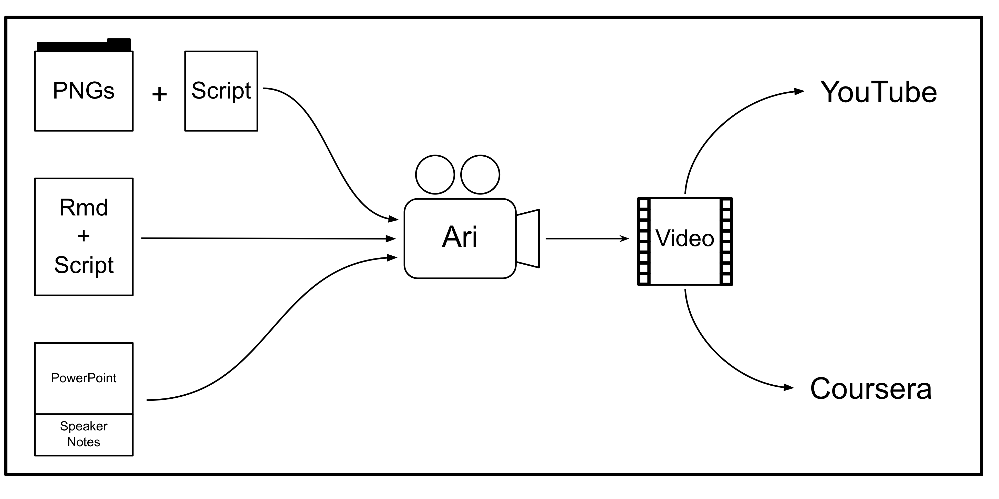

<style type="text/css">
article {
  font-size: 28pt;
}
</style>

```{r setup, include=FALSE}
knitr::opts_chunk$set(
  echo = FALSE, 
  comment = "",
  message = FALSE)
library(ari)
library(ariExtra)
```


<!-- SMI 2019 product -->
# Start of a Package: \n Harmonize all inputs to `ari`

## Workflow of `ari` 

```{r, echo = FALSE, out.width="100%"}

```


## What you need

- `ffmpeg` installed
- API key to Google/Amazon/Microsoft Text-to-Speech APIs


## Workflow of `ari` 

- Images with a audio → `ari_stitch`
- Rmd document with HTML comments → Images with a text script (`ari_narrate`)
- Images with a text script → `ari_spin`
- Text script → audio (`text2speech`)


## Text to Speech

<div id="left_col">

- `googleLanguageR` - Google Cloud Services
- `aws.polly` - Amazon Polly
- `mscstts` - Microsoft Text-to-Speech or Bing Speech (my package)

</div>

</div>
<div id="right_col">
`text2speech` 
```{r, out.width = "100%"}
knitr::include_graphics("figure/rule_them_all.gif")
```
</div>


## Workflow of `ariExtra` 

- PPTX with notes →  `pptx_to_ari`
- Google Slides with notes →  `gs_to_ari`
- `ioslides` Rmd with comments →  `rmd_to_ari`
- `xaringan` Rmd with comments →  `rmd_to_ari`
- PDF + text → `pdf_to_ari`

- All `*_to_ari` functions →  PNGs + comments in MD

## Google Slides Example

https://docs.google.com/presentation/d/1Opt6lv7rRi7Kzb9bI0u3SWX1pSz1k7botaphTuFYgNs/edit#slide=id.p

```{r, out.width = "80%"}
knitr::include_graphics("figure/gs_snap.png")
```

## Google Slides Example

<div class="left-half">
```{r, echo = TRUE}
id = get_slide_id(
  file.path(
    "https://docs.google.com/presentation/d",
    "1Opt6lv7rRi7Kzb9bI0u3SWX1pSz1k7botaphTuFYgNs", 
    "edit#slide=id.p"))
id
```

</div>

</div>
<div class="right-half">
```{r, echo = TRUE, eval = TRUE, message = TRUE}
result = gs_to_ari(id)
```
</div>


